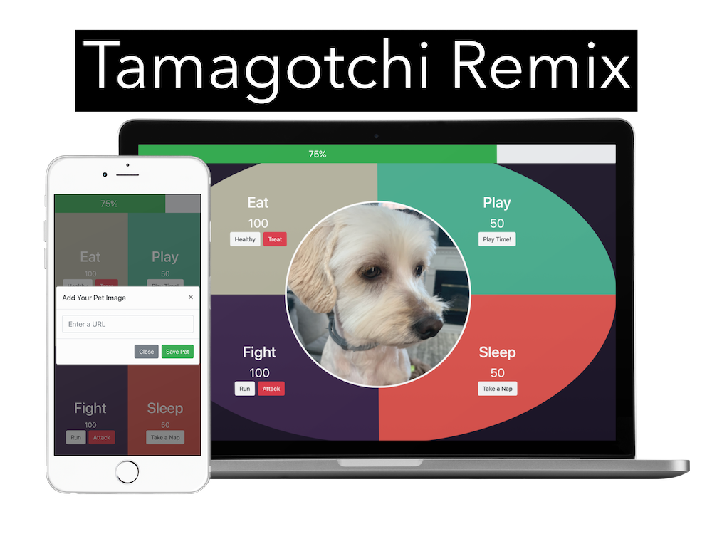
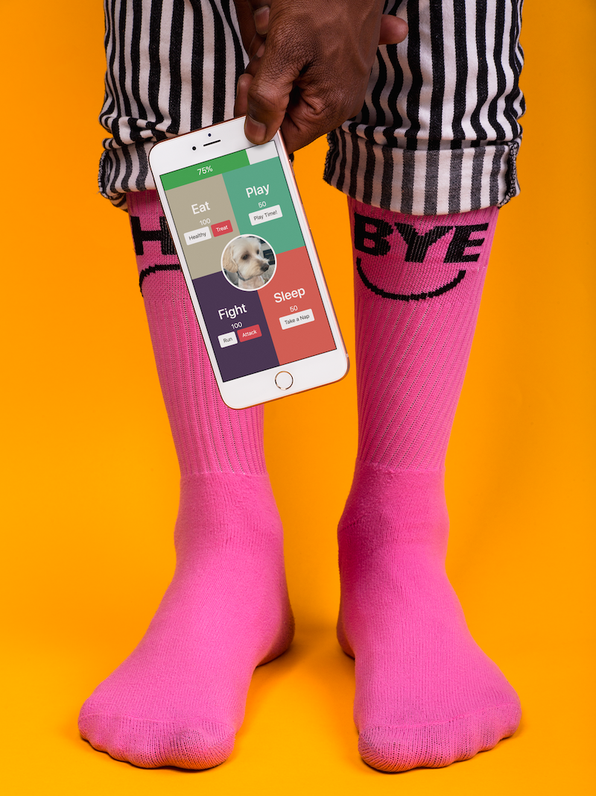

# Tamagotchi REMIX by [Dr. T](https://github.com/drteresavasquez)

[Check out the Demo!](https://drt-tamagotchi.netlify.app/)

Remember Tamagotchi's?  Here is a REMIX

A Tamagotchi was the first "digital virtual pet".  It had three buttons and 8 different menus.  After activating it an egg would hatch and then you would be responsible for keeping your pet alive.  Your pet could do things like eat, sleep, play, get sick, get medicine, and poop.  They sold over 82 million of them before 2017.

You can still buy yourself a real one [HERE](https://www.bandai.com/tamagotchi/)

## Links
- [Deployed Site](https://drt-tamagotchi.netlify.app/)
- [Figma Wireframe](https://www.figma.com/file/a0IBP8M9HcSwANGkzVtTRg/Tamagotchi)
## Features
### Overall Progress Bar
The overall health of your Tamagochi should be based on the average of all four attributes (energy, strength, full, fun).  

### Pet Picture
Your pet deserves a picture.   Enter in a url for a picture.

### Module Interactivity
* When Fullness goes up energy should go down (FOOD COMA)
* When Fullness goes down strength should down
* When Strength goes down energy, full, and fun go down
* When Strength goes up energy goes up.
* When energy goes down fun goes down
